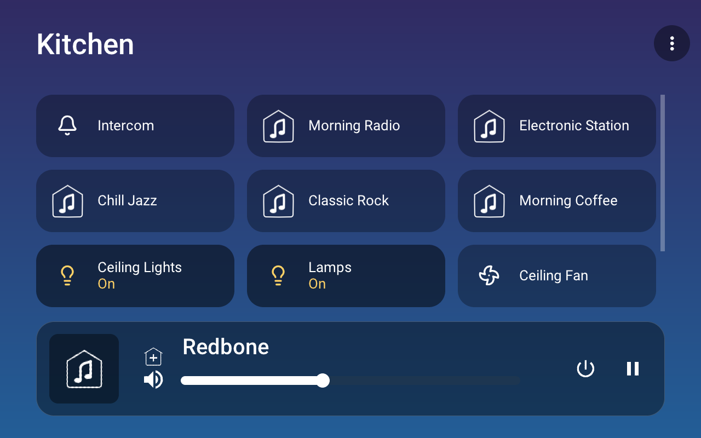
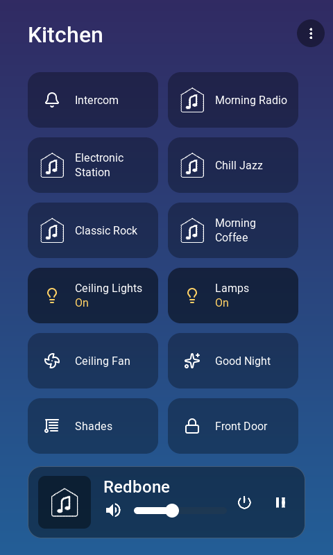
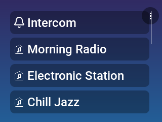
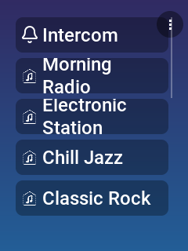

# Supported hardware

MMKeypad runs on off-the-shelf ESP32 development boards and on repurposed
Control4 T3 touch panels. One firmware source tree covers all of them; the build
target is selected by `./board.sh <alias>` (see
[`firmware-idf/README.md`](../firmware-idf/README.md)). Pin assignments for every
board are in [`firmware-idf/main/board.h`](../firmware-idf/main/board.h), the
single source of truth.

## ESP32 boards (native ESP-IDF firmware)

These are all commodity boards you can buy today. Nothing here is custom — the
project ships no PCB. Pick the one that matches how you want to mount and power
the unit.

| `board.sh` | Board | SoC | Network | Display | Audio | Buy |
|------------|-------|-----|---------|---------|-------|-----|
| `s3` | lcdwiki 2.8" ESP32-S3 Display | ESP32-S3-WROOM-1 N16R8 | Wi-Fi | ILI9341V 320×240, FT6336G touch | ES8311 + FM8002E + mic, SIP | [lcdwiki](https://www.lcdwiki.com/2.8inch_ESP32-S3_Display) |
| `ws43` | Waveshare ESP32-P4-WIFI6-Touch-LCD-4.3 | ESP32-P4 (+ C6 for Wi-Fi) | Wi-Fi 6 via onboard ESP32-C6 (`esp_hosted`) | 480×800 portrait DSI, touch | ES8311 + ES7210 dual-mic + HW AEC, SIP | [Waveshare](https://www.waveshare.com/esp32-p4-wifi6-touch-lcd-4.3.htm) |
| `nano` | Waveshare ESP32-P4-NANO + 10.1" DSI | ESP32-P4 | Ethernet (PoE) + Wi-Fi | 800×1280 DSI, touch | ES8311 + ES7210 dual-mic + HW AEC, SIP | [Waveshare](https://www.waveshare.com/esp32-p4-nano.htm) |
| `poe` | Waveshare ESP32-P4-POE-ETH-NH | ESP32-P4 | Ethernet (802.3af PoE) | headless | ES8311 + NS4150B + mic, SIP | [Waveshare](https://www.waveshare.com/esp32-p4-poe-eth.htm) |
| `matrix` | Generic ESP32-S3 devkit + 64×64 HUB75 panel | ESP32-S3-WROOM-1 | Wi-Fi | 64×64 RGB LED (art-only) | none | any ESP32-S3-WROOM-1 N16R8 devkit |

Notes:

- **`s3`** is the reference board and the smallest full keypad — a self-contained
  2.8" touch unit with speaker, amp, and mic. Best starting point.
- **`ws43`** and **`nano`** are the large-panel targets. Both P4 boards have the
  ES7210 capture path with hardware AEC, so they make the best intercom endpoints.
  `ws43` gets Wi-Fi through the onboard ESP32-C6 over `esp_hosted`; `nano` is
  wired (PoE) with Wi-Fi also available.
- **`poe`** is a headless wired node — no display, just the protocol server, SDDP
  discovery, the settings/OTA web server, and the ES8311 + SIP audio path. Use it
  where you want a room's intercom/announcement endpoint without a screen.
- **`matrix`** reuses the whole now-playing pipeline but paints the cover art onto
  a 64×64 HUB75 LED matrix instead of an LCD — no touch, no audio. See
  [`firmware-idf/BOARD-s3_matrix.md`](../firmware-idf/BOARD-s3_matrix.md).

The `matrix` target needs a plain ESP32-S3-WROOM-1 N16R8 devkit (16 MB flash /
8 MB PSRAM) — **not** the lcdwiki keypad board — plus any HUB75 64×64 panel and
the wiring in `BOARD-s3_matrix.md`.

## Control4 T3 panels (Linux firmware)

The [`firmware-linux-t3/`](../firmware-linux-t3/) build turns a **repurposed
Control4 T3 in-wall touchscreen** (RK3188, EOL) into an MMKeypad, running the same
UI and protocol code as the ESP boards on a from-scratch musl/Linux userspace.
This is second-life use of hardware you already own — see
[`reference/t3-control4/`](../reference/t3-control4/) for the full teardown,
the two panel variants, the access method, and how to build/flash a unit.

## What the UI looks like

Rendered by the headless simulator from the real `ui.c`
([`firmware-linux-t3/sim/`](../firmware-linux-t3/sim/)), which draws the shared UI
at each panel's resolution — so these are the actual layouts the firmware
produces, not mockups. The same code reflows from a 10" landscape panel down to a
240×320 keypad.

### 10.1" landscape — `nano` (1280×800)



### 4.3" portrait — `ws43` (480×800)



### 2.8" — `s3` (320×240 landscape and 240×320 portrait)




To regenerate these on your own machine:

```sh
cd firmware-linux-t3/sim
./render.sh      # writes shots/*.png at every panel resolution
```
